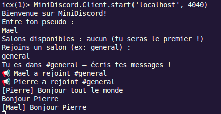
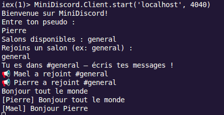
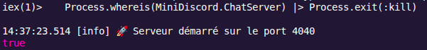
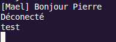
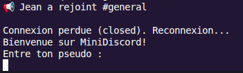
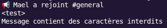

# TP-Programmation_fonctionnelle
## ADVISSE Maël

## Client

### Interaction entre deux clients




### Robustesse

Si le serveur est déconnecté, on a :


Le serveur redemarre automatiquement


Les clients sont déconnectés mais il n'y a pas de reconnexion automatique. Il ne peuvent donc plus envoyer de messages

Apres avoir implémenté la reconnexion automatique, on a :



Le client est déconnecté puis reconnecté. Toutefois, il doit de nouveau choisir son pseudo

### Robustesse OTP 

La gestion OTP permettrait de redémarrer automatiquement un processus qui plante, au lieu de faire tomber toute l’application. Elle rend aussi le code plus robuste, parce que chaque client, salon ou serveur peut être isolé dans son propre processus supervisé

### Filtrage des messages



Les messages contenant des caratères interdit ne s'envoient pas

### Cryptographie

``` elixir
defp chiffrer_message(msg) do
    iv = :crypto.strong_rand_bytes(16)
    msg_chiffre = :crypto.crypto_one_time(:aes_256_ctr, @cle, iv, msg, true)
    Base.encode64(iv <> msg_chiffre)
  end

  defp dechiffrer_message(msg_encode) do
    case Base.decode64(msg_encode) do
      {:ok, msg_binaire} when byte_size(msg_binaire) > 16 ->
        <<iv::binary-size(16), msg_chiffre::binary>> = msg_binaire
        :crypto.crypto_one_time(:aes_256_ctr, @cle, iv, msg_chiffre, false)
      _ ->
        {:error, "Impossible de déchiffrer"}
    end
  end
```

Avant d'envoyer un message, le client le chiffre puis l'encode en base64.
Puis pour lire un message recu, le client decode le base64 et dechiffre le message pour avoir le contenu en clair