# TP-Programmation_fonctionnelle
## ADVISSE Maël

## Server

### Partie 1

*Q1. Pourquoi utilise-t-on Process.monitor/1 dans handle_call({:rejoindre}) ?*
Process.monitor/1 est utilisé dans rejoindre pour que le salon reçoive automatiquement un message `{:DOWN, ...}` si le client (pid) se termine

*Q2. Que se passe-t-il si on n'implémente pas handle_info({:DOWN, ...}) ?* 
Si `handle_info({:DOWN, ...})` n’est pas implémenté, les pids morts restent dans state.clients. Le salon garde donc un état incohérent et continue d’essayer d’envoyer des messages à des processus qui n’existent plus

*Q3. Quelle est la différence entre handle_call et handle_cast ? Pourquoi broadcast est un cast ?*
`handle_call` est synchrone: l’appelant attend une réponse `({:reply, ...})`. `handle_cast` est asynchrone: pas de réponse attendue `({:noreply, ...})`. broadcast est un cast car on veut juste déclencher l’envoi du message à tous, sans bloquer l’appelant pour un résultat.

#### Tests
On realise les tests et on voit que tout fonctionne bien

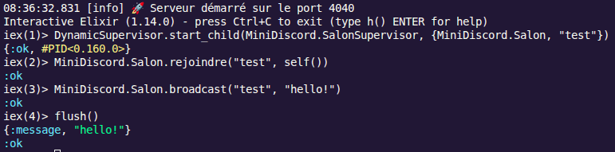

#### Ajoutons un port et testons la connexion
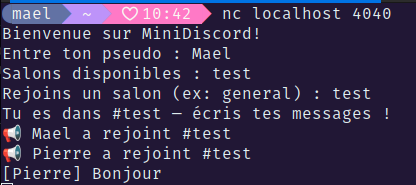 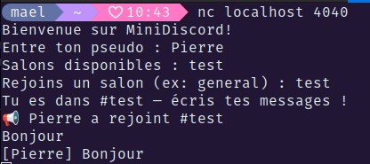

#### On peut également créer un tunnel tcp
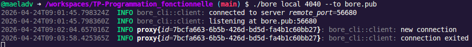

Puis on se connecte avec telnet

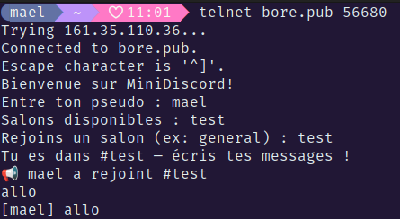

### Partie 2

#### Depuis la console, on trouve le pid du salon et on le kill

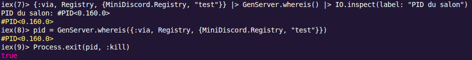

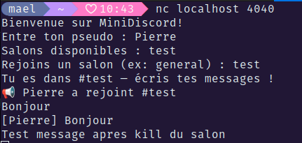

Le salon n'est pas coupé mais on ne peut plus envoyer ou recevoir des messages

*2-4. Le salon redémarre-t-il après le kill ? Pourquoi ?* 

Oui, le salon redémarre en principe après `Process.exit(pid, :kill)`. Le `:kill` termine brutalement le processus, le supervisor le détecte, et comme le salon est démarré sous un DynamicSupervisor avec une stratégie :one_for_one, seul ce salon est relancé.

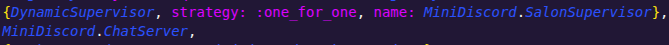

*Quelle est la différence entre les stratégies :one_for_one et :one_for_all ?*
one_for_one relance uniquement le child qui a crashé. :one_for_all relance tous les enfants du supervisor dès qu’un seul tombe. Dans ton projet, le salon est sous un DynamicSupervisor, donc le comportement attendu est plutôt :one_for_one : on redémarre seulement le salon concerné, pas tout le serveur

#### Amélioration — Historique des messages

Le premier client envoie pleins de message 

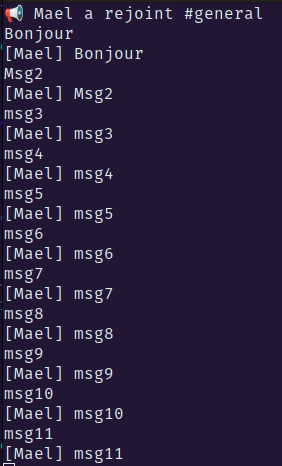

Le deuxieme client se connecte et recupere les 10 derniers messages

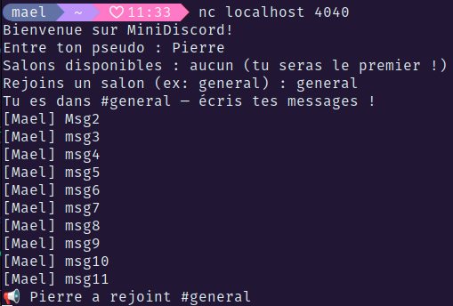

### Partie 3

#### Pseudo uniques

On choisi un pseudo 

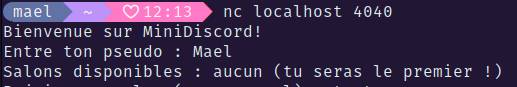

On essaie d'ajouter un client avec le memee pseudo

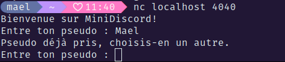

#### Commandes /

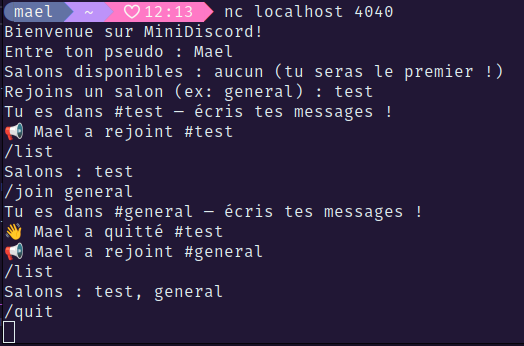